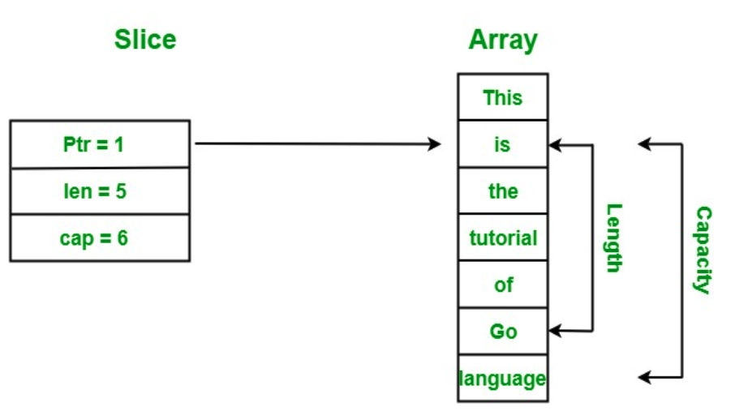

## Slice VS array?

Slices are just a reference to existing arrays. Hence any modification done in the slice will reflect in the underlying array also. 

New elements can be added to the slice using **append** function. Like
```go
readers := []string{"Alice", "Bob", "Charlie"}
fmt.Println("Readers' array :", readers, "has old length", len(readers), "and capacity", cap(readers))
readers = append(readers, "Dytto")
fmt.Println("Readers' array :", readers, "has old length", len(readers), "and capacity", cap(readers))
```
<br>
The output will be

    Readers' array : [Alice Bob Charlie] has old length 3 and capacity 3
    Readers' array : [Alice Bob Charlie Dytto] has new length 4and capacity 6


Why the capacity changes to 6?<br>

### Components of Slice
- Pointer: The pointer is used to point to the first element of the array that is accessible through the slice. **Here, it is not necessary that the pointed element is the first element of the array.**

- Length: The length is the total number of elements present in the array.

- Capacity: The capacity represents the maximum size upto which it can expand.

```go
package main
 
import "fmt"
 
func main() {
 
    // Creating an array
    arr := [7]string{"This", "is", "the", "tutorial",
                         "of", "Go", "language"}
 
    // Display array
    fmt.Println("Array:", arr)
 
    // Creating a slice
    myslice := arr[1:6]
 
    // Display slice
    fmt.Println("Slice:", myslice)
 
    // Display length of the slice
    fmt.Printf("Length of the slice: %d", len(myslice))
 
    // Display the capacity of the slice
    fmt.Printf("\nCapacity of the slice: %d", cap(myslice))
}
```

The output will be
```
Array: [This is the tutorial of Go language]
Slice: [is the tutorial of Go]
Length of the slice: 5
Capacity of the slice: 6
```

Explanation: In the above example, we create a slice from given array, the pointer of which pointed to index1.



### How to create and initialize a Slice?

#### Using an Array
```go 
func main() {
 
    // Creating an array
    arr := [4]string{"Geeks", "for", "Geeks", "GFG"}
 
    // Creating slices from the given array
    var my_slice_1 = arr[1:2]
    my_slice_2 := arr[0:]
    my_slice_3 := arr[:2]
    my_slice_4 := arr[:]
 
    // Display the result
    fmt.Println("My Array: ", arr)
    fmt.Println("My Slice 1: ", my_slice_1)
    fmt.Println("My Slice 2: ", my_slice_2)
    fmt.Println("My Slice 3: ", my_slice_3)
    fmt.Println("My Slice 4: ", my_slice_4)
}
```
```
My Array:  [Geeks for Geeks GFG]
My Slice 1:  [for]
My Slice 2:  [Geeks for Geeks GFG]
My Slice 3:  [Geeks for]
My Slice 4:  [Geeks for Geeks GFG]
```

#### Using make() function
Generally, make() function is used to create an empty slice.<br>
Here, empty slices are those slices that contain an empty array reference.
```go
package main
 
import "fmt"
 
func main() {
 
    // Creating an array of size 7
    // and slice this array  till 4
    // and return the reference of the slice
    // Using make function
    var my_slice_1 = make([]int, 4, 7)
    fmt.Printf("Slice 1 = %v, \nlength = %d, \ncapacity = %d\n",
                   my_slice_1, len(my_slice_1), cap(my_slice_1))
 
    // Creating another array of size 7
    // and return the reference of the slice
    // Using make function
    var my_slice_2 = make([]int, 7)
    fmt.Printf("Slice 2 = %v, \nlength = %d, \ncapacity = %d\n",
                   my_slice_2, len(my_slice_2), cap(my_slice_2))
     
}
```
```
Slice 1 = [0 0 0 0], 
length = 4, 
capacity = 7
Slice 2 = [0 0 0 0 0 0 0], 
length = 7, 
capacity = 7
```

### Iterating over a slice!
#### Using for loop
```go
func main() {
 
    // Creating a slice
    myslice := []string{"This", "is", "the", "tutorial",
        "of", "Go", "language"}
 
    // Iterate using for loop
    for e := 0; e < len(myslice); e++ {
        fmt.Println(myslice[e])
    }
}
```
<br>

#### Using range in for loop
```go
func main() {
 
    // Creating a slice
    myslice := []string{"This", "is", "the", "tutorial",
                                 "of", "Go", "language"}
 
    // Iterate slice
    // using range in for loop
    for index, ele := range myslice {
        fmt.Printf("Index = %d and element = %s\n", index+3, ele)
    }
}   //If you are not to use index, you can just put blank identifier(_)
```


### Important points about Slice
#### Zero value slice
In Go language, you are allowed to create a nil slice that does not contain any element in it. So the capacity and the length of this slice is 0. Nil slice does not contain an array reference.
```go
func main() {
    // Creating a zero value slice
    var myslice []string
    fmt.Printf("Length = %d\n", len(myslice))
    fmt.Printf("Capacity = %d ", cap(myslice))
}
```
```
Length = 0
Capacity = 0
```
<br>

#### Modifying slice
if we change some elements in the slice, then the changes should also take place in the referenced array.
```go
func main() {
    // Creating a zero value slice
    arr := [6]int{55, 66, 77, 88, 99, 22}
    slc := arr[0:4]
 
    // Before modifying
    fmt.Println("Original_Array: ", arr)
    fmt.Println("Original_Slice: ", slc)
 
    // After modification
    slc[0] = 100
    slc[1] = 1000
    slc[2] = 1000
 
    fmt.Println("\nNew_Array: ", arr)
    fmt.Println("New_Slice: ", slc)
}
```
```
Original_Array:  [55 66 77 88 99 22]
Original_Slice:  [55 66 77 88]

New_Array:  [100 1000 1000 88 99 22]
New_Slice:  [100 1000 1000 88]
```

#### Comparison of Slice
In Slice, you can only use '==' operator **to check the given slice is nill or not**.<br>
If you try to compare two slices with the help of == operator then it will give you an error
```go
func main() {
 
    // creating slices
    s1 := []int{12, 34, 56}
    var s2 []int
 
    // If you try to run this commented
    // code compiler will give an error
    /*s3:= []int{23, 45, 66}
      fmt.Println(s1==s3)
    */
 
    // Checking if the given slice is nil or not
    fmt.Println(s1 == nil)
    fmt.Println(s2 == nil)
}
```
```
false
true
```

If you want to compare two slices, then use range for loop to match each element or you can use **DeepEqual** function
<br>

#### Multi-Dimensional Slice
Multi-dimensional slice are just like the multidimensional array, except that slice does not contain the size. 
```go
func main() {
    // Creating multi-dimensional slice
    s1 := [][]int{
        {12, 34},
        {56, 47},
        {29, 40},
        {46, 78},
    }
 
    // Accessing multi-dimensional slice
    fmt.Println("Slice 1 : ", s1)
 
    // Creating multi-dimensional slice
    s2 := [][]string{
        []string{"Geeks", "for"},
        []string{"Geeks", "GFG"},
        []string{"gfg", "geek"},
    }
 
    // Accessing multi-dimensional slice
    fmt.Println("Slice 2 : ", s2)
}
```

#### Sorting of slice
The standard library of Go language provides the sort package which contains different types of sorting methods for sorting the slice of **ints, float64s, and strings**. These functions always sort the elements available is slice in ascending order.
```go
func main() {
 
    // Creating Slice
    slc1 := []string{"Python", "Java", "C#", "Go", "Ruby"}
    slc2 := []int{45, 67, 23, 90, 33, 21, 56, 78, 89}
 
    fmt.Println("Before sorting:")
    fmt.Println("Slice 1: ", slc1)
    fmt.Println("Slice 2: ", slc2)
 
    // Performing sort operation on the
    // slice using sort function
    sort.Strings(slc1)
    sort.Ints(slc2)
 
    fmt.Println("\nAfter sorting:")
    fmt.Println("Slice 1: ", slc1)
    fmt.Println("Slice 2: ", slc2)
}
```
```
Before sorting:
Slice 1:  [Python Java C# Go Ruby]
Slice 2:  [45 67 23 90 33 21 56 78 89]

After sorting:
Slice 1:  [C# Go Java Python Ruby]
Slice 2:  [21 23 33 45 56 67 78 89 90]
```

### Memory allication of slices
- When the slice length is equal to its capacity and you try to append a new element to it, then the new memory is allocated to the slice which has the double capacity as compared to the earlier capacity.
- you are not allowed to store different type of elements in the same slice.<br>


