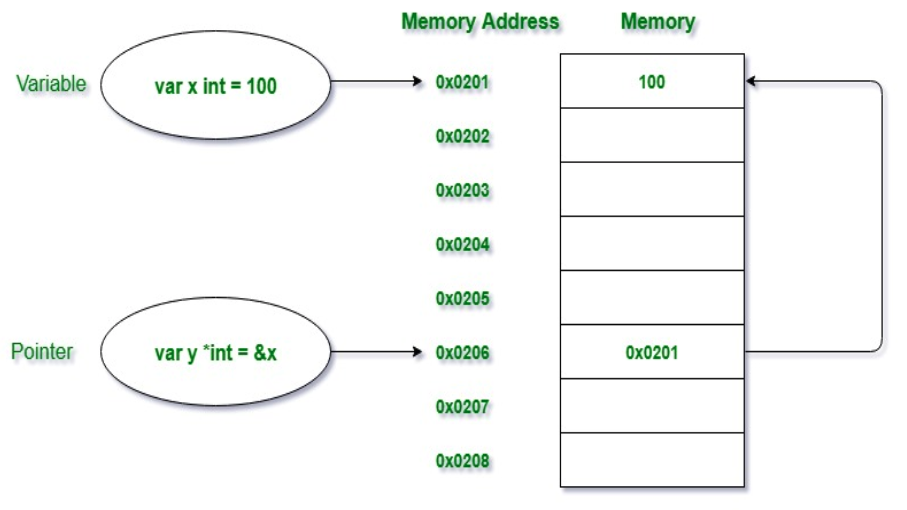

# Pointers in Golang
Pointers in Golang is a variable that is used to store the memory address of ANOTHER variable.<br>
Pointers in Golang is also termed as the special variables. The variables are used to store<br>
some data at a particular memory address in the system. It's also found in hexadecimal format like:<br>

    0xFFAAF


## What is the need for the pointers? 
To understand this need, first, we have to understand the concept of variables.<br>
Variables are the names given to a memory location where the actual data is stored.<br>
To access the stored data we need the address of that particular memory location.<br><br>

To remember all the memory addresses(Hexadecimal Format) manually is an overhead<br> 
that’s why we use variables to store data and variables can be accessed just by using their name.<br>

## So, what is a pointer?
A pointer is a special kind of variable that is not only used to store the memory addresses of other variables but also points where the memory is located and provides ways to find out the value stored at that memory location.<br><br>

It is generally termed as a Special kind of Variable because it is almost declared as a variable but with *(dereferencing operator).<br>


## Declaration and initialization of pointers
Before we start there are two important operators which we will use in pointers i.e. 
- *Operator : A.K.A dereferencing operator, used to declare pointer variable and access the value stored in the address.
- &Operator : used to **return the address of a variable** or **to access the address of a variable** to a pointer. 

```go
var pointer_name *Data_Type
```
<br>

Example below shows a pointer of type string which can store only the memory addresses of string variables.<br>

```go
var s *string
```

compare this to normal initialization of variable:
```go
//normal variable declaration
var a = 45

// initialization of pointer s with
// memory address of variable a
var s *int = &a
```

## Dereferencing the Pointer
As we know that * operator is also termed as the dereferencing operator. It is not only used to declare the pointer variable but also used to access the value stored in the variable.<br><br>


```go

package main
  
import "fmt"
  
func main() {
    // using var keyword
    // we are not defining
    // any type with variable
    var y = 458
      
    // taking a pointer variable using
    // var keyword without specifying
    // the type
    var p = &y
  
    fmt.Println("Value stored in y = ", y)
    fmt.Println("Address of y = ", &y)
    fmt.Println("Value stored in pointer variable p = ", p)
 
    // this is dereferencing a pointer
    // using * operator before a pointer
    // variable to access the value stored
    // at the variable at which it is pointing
    fmt.Println("Value stored in y(*p) = ", *p)
 
}
```


You can also change the value of the pointer or at the memory location instead of assigning a new value to the variable.<br> Example:

```go
import "fmt"
  
func main() {
  
    // using var keyword
    // we are not defining
    // any type with variable
    var y = 458
      
    // taking a pointer variable using
    // var keyword without specifying
    // the type
    var p = &y
  
    fmt.Println("Value stored in y before changing = ", y)
    fmt.Println("Address of y = ", &y)
    fmt.Println("Value stored in pointer variable p = ", p)
 
    // this is dereferencing a pointer
    // using * operator before a pointer
    // variable to access the value stored
    // at the variable at which it is pointing
    fmt.Println("Value stored in y(*p) Before Changing = ", *p)
 
    // changing the value of y by assigning
    // the new value to the pointer
    *p = 500
 
     fmt.Println("Value stored in y(*p) after Changing = ",y)
 
}
```